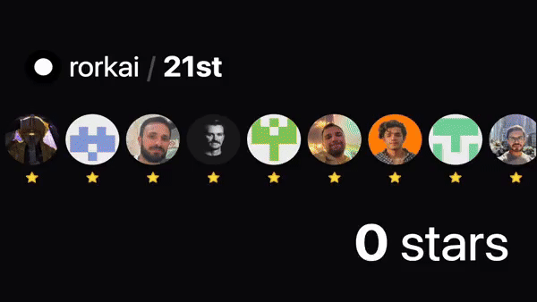

# GitHub Stars Video Generator

Create beautiful animations showing the growth of stars on any GitHub repository. Perfect for social media posts, presentations, or documentation.



## Features

- 🎬 Generate smooth animations of GitHub star count growth
- 🎨 Dark/Light theme support
- ⚡️ Built with Next.js 14 and Remotion
- 🔄 Real-time preview
- 📱 Responsive design
- 🎯 Easy to use - just enter a repository name

## Getting Started

### Prerequisites

- Node.js 18+
- GitHub Personal Access Token (for API access)

### Installation

1. Clone the repository:

```bash
git clone https://github.com/serafimcloud/github-stars-video.git
cd github-stars-video
```

2. Install dependencies:

```bash
npm install
```

3. Create a `.env` file in the root directory with the following variables:

```env
REMOTION_AWS_ACCESS_KEY_ID="dummy"
REMOTION_AWS_SECRET_ACCESS_KEY="dummy"
REMOTION_AWS_REGION="us-east-1"
REMOTION_AWS_FUNCTION_NAME="dummy"
REMOTION_SERVE_URL="http://localhost:3000"
GITHUB_ACCESS_TOKEN="your_github_token"
NEXT_PUBLIC_BASE_URL="http://localhost:3000"
```

> **Note**: To get your GitHub token:
>
> 1. Go to [GitHub Settings > Developer Settings > Personal Access Tokens](https://github.com/settings/tokens)
> 2. Generate a new token with `repo` and `read:user` permissions
> 3. Copy the token to your `.env` file

4. Start the development server:

```bash
npm run dev
```

5. Open [http://localhost:3000](http://localhost:3000) in your browser

## Usage

1. Enter a GitHub repository name in the format `username/repository`
2. Wait for the animation to load
3. To save the animation, simply record your screen while it plays
4. Share your awesome video! 🎉

## Tech Stack

- [Next.js 14](https://nextjs.org/)
- [Remotion](https://www.remotion.dev/)
- [Tailwind CSS](https://tailwindcss.com/)
- [shadcn/ui](https://ui.shadcn.com/)
- [GitHub API](https://docs.github.com/en/rest)

## Contributing

Contributions are welcome! Feel free to open issues and pull requests.

## Credits

Originally created by [Sebastien Castiel](https://scastiel.dev)  
Enhanced by [serafim](https://x.com/serafimcloud)

## License

MIT License - feel free to use this in your own projects!
